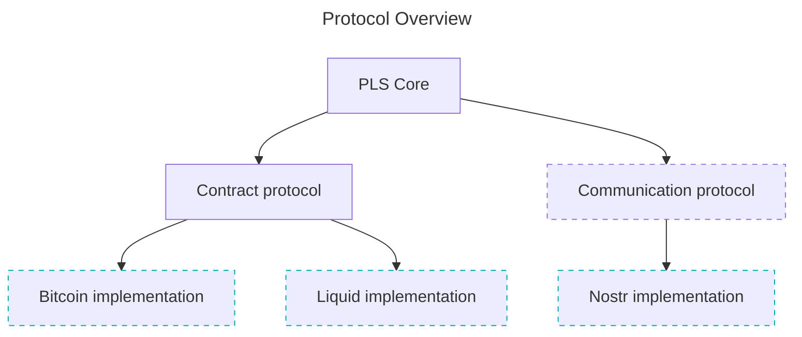

# Private Law Society (PLS) Protocol

Simple and powerful private contracts built on Bitcoin and Nostr (optionaly).

The biggest problem with private contracts until now was that they were still subject to State justice. Using PLS and creating your contract document following some [good practices](#good-practices), the execution of the contract becomes governed exclusively by the parties involved and their arbitrators (freely chosen by mutual agreement).

In short, collateral is deposited in a multisig wallet with the quorum desired by the parties. Any Bitcoin wallet with multisig support can be used to audit and validate the contracts created (requires good knowledge of multisig).

Nostr is used (but not required) as a communication layer so that the entire signature flow is more user friendly. It is possible to have a completely offline client, where files (pdf, json, etc.) are exchanged externally (email, discord, etc.).

### Good practices:

- Never include personal data on your contract document (names, document numbers or addresses), use nicknames when necessary.

### Quorum:

- The contract can have only one arbitrator if it has a very low value, but the recommended are 3 (multisig with 1 party plus 2-of-3 arbitrators) or 5 (multisig with 1 party plus 3-of-5 arbitrators).
- At any time, both parties to the agreement can withdraw funds from multisig in any way they wish, without the participation of any arbitrator. This is how the parties withdraw their collateral if the contract ends without dispute.
- After the contract ends and if one of the parties starts a dispute, one of the parties plus the quorum of arbitrators will be able to withdraw the funds. That is why a good selection of arbitrators is so important.

### Protocol specification

See the PLIPs and especially [PLIP-01](plips/01.md) for a short and simple explanation of the protocol spec.

- [PLIP-01](plips/01.md) - contract protocol spec
- [PLIP-02](plips/02.md) - communication protocol spec
- PLIP-03 - bitcoin contract spec
- PLIP-04 - liquid contract spec
- PLIP-05 - nostr communication spec
