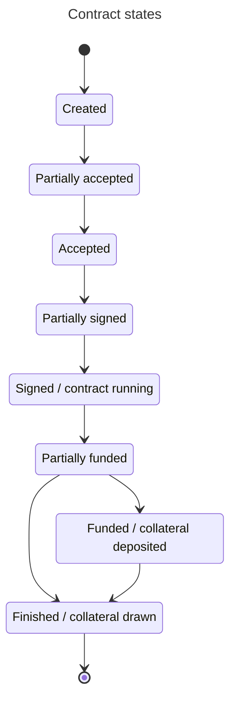

# PLIP-01

## Contract protocol spec

`draft` `mandatory`

This PLIP defines the Bitcoin contract rules and colateral flow that should be implemented by everybody.

## Contract document

The contract document can be any human readable file: txt, doc, pdf. Idealy not using any real party information for privacy and to avoid interference from State Courts.

## Contract json

This is the machine readable contract file version 1. New versions may be created in the future, but clients must allow previous versions, or at least warn that the version is not supported.

```json
{
    "version": 1,
    "state": <one of the possible states>,
    "createdAt": <unix timestamp in seconds>,
    "document": {
        "fileHash": <sha256 hash of contract document file contents>,
        "pubkeys": {
            "clients": [
                <secp256k1 public key to validate signature>,
                <secp256k1 public key to validate signature>
            ],
            "arbitrators": [
                <secp256k1 public key to validate signature>,
                ...
            ],
        },
    },
    "collateral": {
        "network": <string containing the network name - initially bitcoin or liquid>,
        "pubkeys": {
            "clients": [
                <string or array with public key data to create the multisig>,
                <string or array with public key data to create the multisig>
            ],
            "arbitrators": [
                <string or array with public key data to create the multisig>,
                ...
            ],
        },
        "arbitratorsQuorum": <integer between 0 and the number of arbitrators>,
        "multisigAddress": <string with multisig address>,
    },
    "signatures": {
        <public key existent on document.pubkeys>: <signature of this json without the 'signature' key>
    }
}
```

Each user has a Hierarchical Deterministic (HD) Wallet created from a mnemonic. Signatures, public key, and encodings are done according to the Schnorr signatures standard for the curve secp256k1.

Nostr identifiers are derived according to [NIP-06](https://github.com/nostr-protocol/nips/blob/master/06.md).

Collateral public keys are generated from the HD Wallet starting from index 0 and incremented by 1 on each accepted contract. Multisig addresses are [Taproot](https://github.com/bitcoin/bips/blob/master/bip-0341.mediawiki) and spend scripts are organized as Tap Leaves.


### Contract json states

At any given time contracts may be in one of the following states: 

